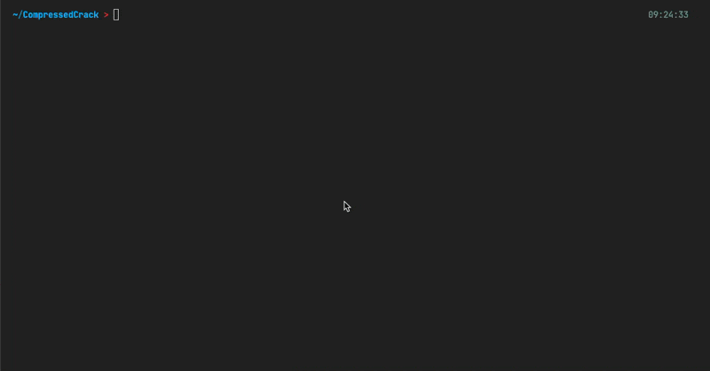

# CompressedCrack

CompressedCrack is a command-line tool that performs a brute force attack to crack the password of a compressed file. It generates password combinations based on user-defined character sets and length range, and attempts to extract the archive using each generated password until the correct password is found.

## Features

- Supports various compressed file formats (e.g., zip, rar, 7z) using the patoolib library
- Allows customization of character sets (letters, numbers, special characters)
- Configurable minimum and maximum password lengths
- Displays the found password, total number of attempts, and execution time
- Verbose mode for detailed output during the cracking process

## Requirements

- Python 3.x
- `patoolib` library

To install the required library, run the following command:

```
pip install patoolib
```

## Usage

```
main.py [-h] [--min-length MIN_LENGTH] [--max-length MAX_LENGTH] [--verbose] file_path

Crack password-protected archives using brute force.

positional arguments:
  file_path             Path to the compressed file.

options:
  -h, --help            show this help message and exit
  --min-length MIN_LENGTH
                        Minimum password length.
  --max-length MAX_LENGTH
                        Maximum password length.
  --verbose             Increase output verbosity.

```

### Customizing Character Sets

uring execution, the script will prompt the user to include letters, numbers, and special characters in the password generation process. For each selected character type, the user can choose to use the default set or provide a custom set.

Default character sets:

- Letters: `abcdefghijklmnopqrstuvwxyzABCDEFGHIJKLMNOPQRSTUVWXYZ`
- Numbers: `0123456789`
- Special characters: `!@#$%^&\*()-\_+=~[]{}|\:;"'<>,.?\`

If no character types are selected, the script will use the combination of all default character sets.

## Examples

1. Crack a password-protected RAR file with default settings:

```
python main.py archive.rar
```

2. Crack a password-protected zip file with a minimum password length of 3 characters, maximum password length of 5 characters, verbose output, and the custom character set `abcdef12345`:

```
python main.py --min-length 3 --max-length 5 --verbose archive.zip
```


